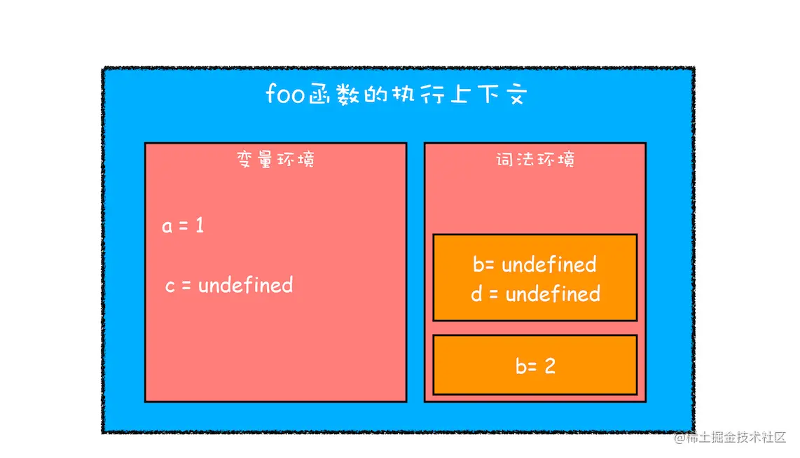

### 二、变量环境

在 ES6 中，LexicalEnvironment 组件和 VariableEnvironment 组件的区别在于前者用于存储函数声明和变量（ let 和 const ）绑定，而后者仅用于存储变量（ var ）绑定。
变量环境只有全局和函数作用域，词法环境则是有全局、块、函数

在词法环境内部，维护了一个小型栈结构，栈底是函数最外层的变量（通过let或者const声明），进入一个作用域块后，就会把该作用域块内部的变量（（通过let或者const声明））压到栈顶；当作用域执行完成之后，该作用域的信息就会从栈顶弹出，这就是词法环境的结构

[ES6：理解词法环境和变量环境](https://juejin.cn/post/7116095340859621412#heading-1)