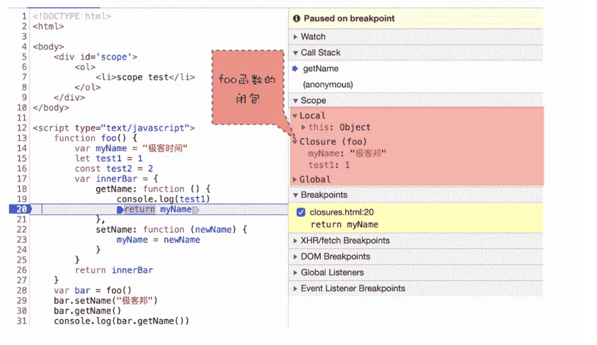

### V8如何实现闭包？

- **惰性解析机制**：
  由于一次性解析和编译所有JavaScript代码会导致：
  - **编译时间延长**：大体积代码（如10多兆的页面脚本）会显著增加用户首次加载的等待时间。
  - **内存占用**：解析后的字节码和编译的机器代码持续占用宝贵内存资源，尤其是在移动设备上。
  
  因此，V8及其它主流JavaScript虚拟机采用**惰性解析**策略。这一策略意味着在解析过程中，遇到函数声明时，仅生成顶层代码的抽象语法树（AST）和字节码，跳过函数内部代码的解析，直至函数真正被调用时才进行。

### 预解析器如何处理闭包问题？

1. **语法错误检查**：
   - 预解析过程能识别函数内的语法错误，确保代码正确性。

2. **管理外部变量引用**：
   - 当检测到函数内部引用外部变量时，预解析器会将这些变量从栈复制到堆中。这样，即使函数执行完毕，堆中的变量引用仍然保持，确保闭包能够访问到所需数据，避免了因作用域链断裂而导致的问题。

“从图中可以看出来，当调用 bar.getName 的时候，右边 Scope 项就体现出了作用域链的情况：Local 就是当前的 getName 函数的作用域，Closure(foo) 是指 foo 函数的闭包，最下面的 Global 就是指全局作用域，从“Local–>Closure(foo)–>Global”就是一个完整的作用域链。所以说，你以后也可以通过 Scope 来查看实际代码作用域链的情况，这样调试代码也会比较方便。”

### 闭包的回收

- **生命周期与回收条件**：
  - 若闭包被全局变量引用，它将持续存在直至页面关闭。
  - 对于局部变量引用的闭包，当其所在作用域销毁且不再被任何活动代码引用时，垃圾回收器会在下次执行回收时释放这部分内存。
  
- **避免内存泄漏建议**：
  - 长期使用的闭包适合设计为全局变量。
  - 短时或占用大量内存的闭包应限制为局部变量，以减少内存占用和避免潜在的内存泄漏风险。

综上所述，V8通过惰性解析和预解析器的智能管理，有效支持了闭包的实现和内存管理，同时要求开发者在使用闭包时，考虑其生命周期对内存的影响，以实践更高效的内存管理策略。