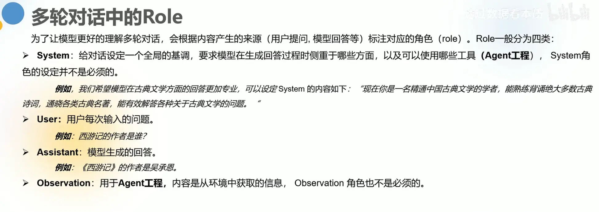
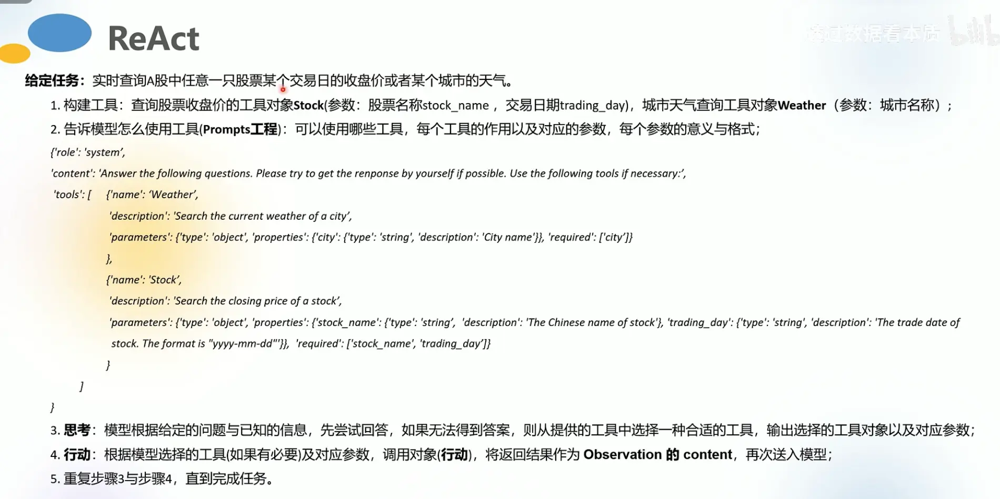
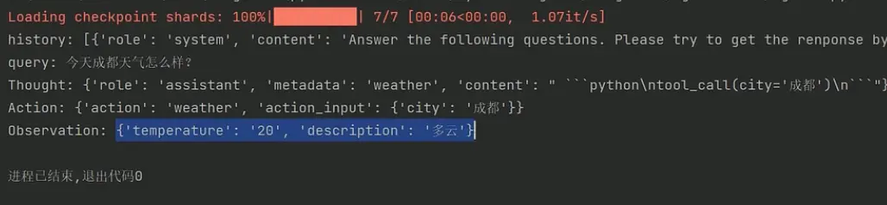

### 从Few-Shot到CoT(思维链)。附案例：使用ChatGLM3生成知识图谱

### Few-Shot 的局限性

Few-Shot Learning（少量样本学习）是一种机器学习方法，它旨在通过仅使用几个（通常是5个或更少）样本对新类别进行学习和分类。这种方法对于处理标注数据稀缺的场景非常有吸引力。然而，尽管Few-Shot Learning展现出了巨大的潜力，它也存在一些局限性：

1. **泛化能力有限**：由于模型是基于极其有限的样本进行训练的，其泛化能力可能受限。模型可能过度拟合这些少数样本，导致在遇到稍微变化的数据或新样本时表现不佳。

2. **领域迁移问题**：在不同数据域之间进行few-shot学习时，如果源域和目标域之间的差异较大，模型可能难以有效泛化。领域适应性是一个挑战，特别是在特征分布变化较大的情况下。

3. **缺乏多样性**：少量样本往往不能充分代表整个类别的变化范围，尤其是在类别内部差异较大的情况下。这可能导致模型学习到的特征不够全面，影响识别和分类性能。

4. **数据偏斜**：如果少数样本不足以反映类别的平衡分布，模型可能会偏向于那些在样本中过度表示的特征，从而忽视其他重要但未充分展现的特征。

5. **算法复杂度**：一些先进的few-shot学习算法，如元学习、生成模型等，可能具有较高的计算复杂度和内存需求，这限制了它们在资源受限环境下的应用。

6. **对先验知识的需求**：为了弥补数据量的不足，许多few-shot学习方法依赖于强大的先验知识或者元学习策略。缺乏合适的先验或元学习机制可能会影响学习效果。

7. **评估难度**：由于每个类别的样本量极少，如何有效地评估模型的性能也是一个难题。传统的交叉验证方法可能不再适用，因为分割出验证集会进一步减少每个类别的样本数量。

综上所述，尽管Few-Shot Learning为解决小样本学习问题提供了新的视角，但其实现和应用仍然面临着一系列挑战。未来的研究可能会集中在如何更好地利用外部知识、提高模型的泛化能力以及优化算法效率等方面。

### 思维链

思维链（Chain of Thought，简称CoT）是一种方法论，特别在人工智能和自然语言处理领域中用于指导和改进大型语言模型（LLMs）的推理过程。这种方法通过让模型展示其解决问题的逐步逻辑推理，提高了模型在执行复杂任务时的透明度和准确性。

思维链（Chain of Thought，简称CoT）是一种方法论，特别在人工智能和自然语言处理领域中用于指导和改进大型语言模型（LLMs）的推理过程。这种方法通过让模型展示其解决问题的逐步逻辑推理，提高了模型在执行复杂任务时的透明度和准确性。具体来说，CoT涉及以下几个关键点：

1. **逐步推理**：CoT要求模型在生成最终答案之前，将其思考路径分解成一系列有序的、易于理解的步骤。每个步骤都代表了推理过程中的一个逻辑环节，帮助外界理解模型是如何从已知信息推导至结论的。

2. **逻辑链结构**：这些中间推理步骤形成了一个逻辑链条，展示了从输入信息到输出答案的完整思维流程。这样不仅能够揭示模型的思维逻辑，还有助于发现和修正潜在的推理错误。

3. **提升复杂任务性能**：CoT最初被设计用来增强模型在算术推理、常识推理、象征性推理等复杂认知任务上的表现。通过明确地引导模型进行分步推理，可以克服传统一跳式（直接从输入到输出）方法的局限性。

4. **改进提示策略**：它被视为一种高级的提示工程（Prompt Engineering）技术，通过精心设计的提示来激发模型的推理能力。这些提示通常包含示例性的思维链，以引导模型模仿并生成类似的逻辑推理过程。

5. **促进可解释性**：CoT增加了AI决策的可解释性，使得用户和研究人员能更好地理解模型的工作原理，这对于建立信任、调试错误和合规性至关重要。

简而言之，思维链（CoT）通过模拟人类的逐步思考方式，加强了大型语言模型在理解和执行需要深度逻辑推理任务方面的能力，同时增强了模型输出的可解释性。

### ReAct 的原理

# 对话的角色

# 怎么自定义工具，提示词工程怎么写

打印的日志

相关文章 https://juejin.cn/post/7307471267481042955
