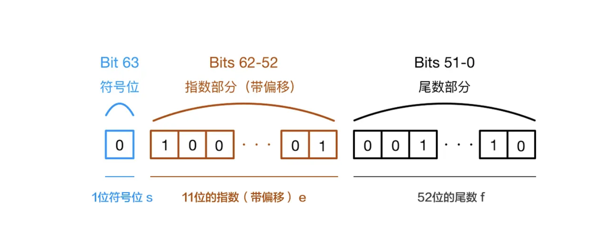

JavaScript是如何表示数字的？

JavaScript使用Number类型表示数字（整数和浮点数），遵循 IEEE 754 标准 通过64位来表示一个数字

通过图片具体看一下数字在内存中的表示

图片文字说明
第0位：符号位，0表示正数，1表示负数(s)
第1位到第11位：储存指数部分（e）
第12位到第63位：储存小数部分（即有效数字）f 存储小数部分的有效数字，首位1是隐含的，实际存储52位。

既然说到这里，再给大家科普一个小知识点：js最大安全数是 Number.MAX_SAFE_INTEGER == Math.pow(2,53) - 1, 而不是Math.pow(2,52) - 1, why？尾数部分不是只有52位吗?
这是因为二进制表示有效数字总是1.xx…xx的形式，尾数部分f在规约形式下第一位默认为1（省略不写，xx..xx为尾数部分f，最长52位）。因此，JavaScript提供的有效数字最长为53个二进制位（64位浮点的后52位+被省略的1位）

### 52 个尾数 只保存 小数位吗

在IEEE 754双精度浮点数格式中，52位尾数（也称为“ significand”或者“fraction”）并不只保存小数位。实际上，这52位包括了小数点后的所有位以及一个隐含的最高位“1”。这个隐含的最高位不直接存储在二进制序列中，但是它在计算浮点数的实际值时总是存在的。因此，尽管存储的是52位，但实际的尾数值相当于一个53位的二进制数（前导的1加上实际存储的52位）。

具体来说，当一个浮点数被规范化后，其形式变为 \(1.xxxxxxx... \times 2^{e}\)，其中 \(x\) 代表尾数部分，包括了那个未存储的最前面的1和后面跟着的52位小数。这样设计可以保证浮点数的精度和范围。

例如，如果我们将十进制数12.12转换成二进制并规范化，我们会得到类似于 \(1.212... \times 2^3\) 的形式，这里的“1.”就是隐含的，实际存储的尾数是从第一个小数位开始的那部分。因此，尽管“1”没有被显式存储，它是计算中不可或缺的一部分。

## 二进制数转换成十进制数

由二进制数转换成十进制数的基本做法是，把二进制数首先写成加权系数展开式，然后按十进制加法规则求和。这种做法称为"按权相加"法。

### 十进制数转换为二进制数

十进制数转换为二进制数时，由于整数和小数的转换方法不同，所以先将十进制数的整数部分和小数部分分别转换后，再加以合并。

### 十进制整数转换为二进制整数

十进制整数转换为二进制整数采用"除2取余，逆序排列"法。具体做法是：用2去除十进制整数，可以得到一个商和余数；再用2去除商，又会得到一个商和余数，如此进行，直到商为零时为止，然后把先得到的余数作为二进制数的低位有效位，后得到的余数作为二进制数的高位有效位，依次排列起来。

### 十进制小数转换为二进制小数

十进制小数转换成二进制小数采用"乘2取整，顺序排列"法。具体做法是：用2乘十进制小数，可以得到积，将积的整数部分取出，再用2乘余下的小数部分，又 得到一个积，再将积的整数部分取出，如此进行，直到积中的整数部分为零，或者整数部分为1，此时0或1为二进制的最后一位。或者达到所要求的精度为止。

1. \(0.125 \times 2 = 0.25\)，取整后得到0，所以第一位是0。
2. \(0.25 \times 2 = 0.5\)，取整后得到0，所以第二位也是0。
3. \(0.5 \times 2 = 1\)，取整后得到1，所以第三位是1，同时计算结束，因为我们得到了一个整数1，意味着小数点后三位的二进制表示已经足够精确。

因此，0.125的二进制表示为0.001。这个过程体现了乘2取整、顺序排列的转化逻辑。

# 十进制的 小数 转化为二进制数据 为什么是 乘2取整，顺序排列

将十进制小数转化为二进制，实际上是执行一个不断乘以2并取整的过程，这个过程类似于十进制转二进制整数时的除2取余法，但方向相反。下面是这种方法的具体解释：

1. **乘2取整原理**：
   - 当你有一个十进制小数，比如0.125，想要转换成二进制表示，你是在寻找一个二进制分数，它的和能最接近或等于这个十进制值。
   - 乘以2是因为二进制系统是基于2的幂次的，每次乘2相当于将小数点向右移动一位，这有助于我们逐步确定每一位的值（0或1）。
   - 取整操作是选取乘以2后得到的数的整数部分。这是因为二进制表示中每个位置的数字只能是0或1，取整就是决定这一位的值。

2. **顺序排列**：
   - 每次乘2取整后得到的整数部分，实际上代表了当前步骤中二进制小数点后对应位置的位值。
   - 由于小数点后的第一位代表\(2^{-1}\)，第二位代表\(2^{-2}\)，以此类推，所以每一步的结果是按照从小数点开始，从左到右的顺序排列的。
   - 不断重复这个过程，直到得到一个足够精度的结果或者发现循环节（对于循环小数而言）。

举例说明，将十进制小数0.125转换为二进制：

1. \(0.125 \times 2 = 0.25\)，取整后得到0，所以第一位是0。
2. \(0.25 \times 2 = 0.5\)，取整后得到0，所以第二位也是0。
3. \(0.5 \times 2 = 1\)，取整后得到1，所以第三位是1，同时计算结束，因为我们得到了一个整数1，意味着小数点后三位的二进制表示已经足够精确。

因此，0.125的二进制表示为0.001。这个过程体现了乘2取整、顺序排列的转化逻辑。

#### decimal.js 计算浮点数的原理

原理 它的原理就是将数字用字符串表示，字符串在计算机中可以说是无限的。 并使用基于字符串的算术运算，以避免浮点数运算中的精度丢失。 它使用了一种叫做十进制浮点数算术（Decimal Floating Point Arithmetic）的算法来进行精确计算

`decimal.js` 是一个JavaScript库，专为高精度浮点数运算而设计，以解决JavaScript原生浮点数运算中可能出现的精度丢失问题。它使用字符串形式存储数字，从而避免了二进制浮点数表示（如IEEE 754标准）可能导致的精度误差。以下是其工作原理的几个关键点：

1. **字符串存储**：`decimal.js` 中的数字不是以JavaScript的`Number`类型存储，而是以字符串的形式存储，这样可以精确表示任何小数点后的数字，不受二进制浮点数精度限制的影响。

2. **算术运算**：在进行加、减、乘、除等运算时，`decimal.js` 会对输入的字符串形式的数字进行解析，然后使用专门设计的算法进行高精度计算。这意味着每个运算都是基于字符的逐位操作，确保了运算结果的精确度。

3. **动态精度管理**：用户可以设置运算的精度，即小数点后保留的位数。这使得在进行诸如除法运算时，可以控制小数点后产生多少位小数，避免不必要的精度损失或过度膨胀。

4. **四舍五入规则**：提供了多种舍入模式（如四舍五入、向上取整、向下取整等），使得用户可以根据需要选择合适的舍入方式处理计算结果。

5. **方法和属性**：`decimal.js` 对象提供了丰富的API，包括基本的数学运算、比较、格式化、舍入等方法，以及一些高级功能，如对数、指数、三角函数等，所有这些操作都在高精度环境下执行。

6. **链式调用**：支持方法的链式调用，使得代码更加简洁易读，例如可以连续进行多个运算而不必在每个步骤中创建新的变量。

综上所述，`decimal.js` 通过将浮点数以字符串形式存储，并实现一套基于字符串的高精度算术运算算法，克服了JavaScript原生浮点数运算的精度局限，特别适用于金融、科学计算等对精度要求严格的场景。

https://juejin.cn/post/6844903680362151950

[IEEE 754 怎么存储数据的？](https://juejin.cn/post/6876220553473196045)