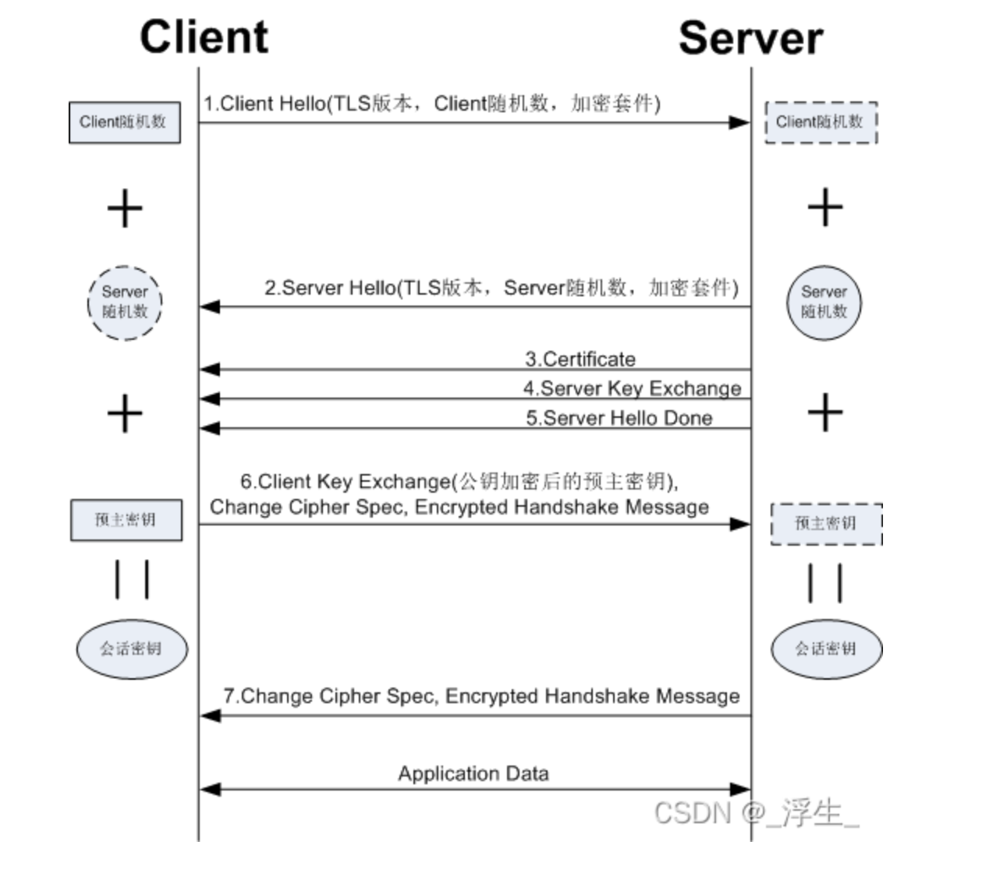

关于TLS 1.2的“三次握手”这个表述可能存在一定的误解。实际上，TLS 1.2协议的握手过程并不是“三次握手”，而是涉及更多的往返通信（RTT，Round-Trip Time），通常需要至少两个RTT（四次握手）来完成。以下是TLS 1.2握手的基本步骤，更准确地反映了这一过程：

1. **Client Hello**: 客户端发送一个`Client Hello`消息给服务器，这个消息包含了客户端支持的最高TLS版本、支持的加密套件列表、一个随机数（Client Random）以及其他可能的扩展信息。

2. **Server Hello**: 服务器从客户端提供的选项中选择一个加密套件、一个压缩方法（如果客户端提出的话），并回送一个`Server Hello`消息给客户端，这个消息包含服务器选定的加密套件、会话ID、一个新的随机数（Server Random）等信息。

3. **Certificate**: 如果协商的加密套件需要服务器证书，服务器会发送它的数字证书给客户端。这一步用于客户端验证服务器的身份。

4. **Server Key Exchange**: 对于某些密钥交换算法（如DHE或ECDHE），服务器还会发送一个`Server Key Exchange`消息，包含用于密钥协商的必要参数。

5. **Server Hello Done**: 服务器发送`Server Hello Done`消息，表示服务器已经发送完毕所有的握手消息。

6. **Client Key Exchange**: 客户端处理服务器的证书（验证其真实性并提取公钥），然后生成预主密钥（Premaster Secret），使用服务器的公钥加密后发送给服务器。

7. **Change Cipher Spec & Finished**: 客户端通知服务器它将开始使用新协商的密钥和算法进行加密通信，通过发送`Change Cipher Spec`协议消息，接着发送一个`Finished`消息，该消息是第一个使用新密钥加密的消息，用于验证握手的完整性。

8. **Server Change Cipher Spec & Finished**: 服务器同样切换到新密钥，并发送自己的`Change Cipher Spec`和`Finished`消息，以确认握手成功并开始加密的数据传输。

整个过程涉及到至少四次消息交换（两次往返），而不是三次。这是因为在TCP层面上虽然有“三次握手”来建立连接，但在TLS层面上，密钥交换和身份验证的过程更加复杂，需要额外的步骤来确保安全性的建立。

- ca证书生成的过程

下图是数字证书生成过程

服务器用hash算法 对自己的公钥 进行hash运算生成摘要
服务器将 数字证书和 生成的摘要信息 发送给ca 
ca生成一对 公钥和私钥 然后用自己的私钥对 服务器发送的摘要信息 加密 返回给客户端

认证过程
客户端收到服务端发送的ca证书，用ca的公钥对数字证书的数字签名 解密，拿到摘要信息
客户端用 相同的hash算法 对数字证书 进行运算，拿到hash值，hash值与解密后的 摘要信息比对

证书链

中间ca 和 根ca

- 什么是RTT

RTT（Round-Trip Time）往返时延，是计算机网络中的一个重要性能指标，它衡量的是从发送端发送数据开始，到发送端接收到接收端的确认消息所经历的总时间。这个时间包括了数据在网络中的传播延迟（这取决于物理距离和信号传播速度）、接收端的处理时间（比如数据包的解包、处理确认信息的生成）、以及可能的路由器处理和队列延迟等

