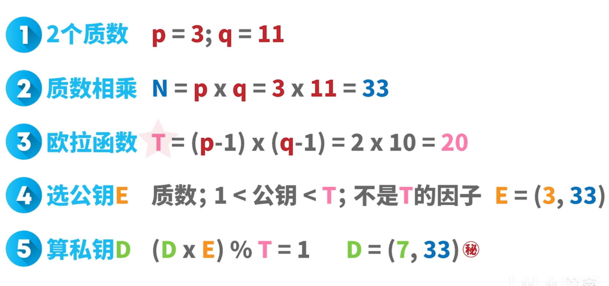
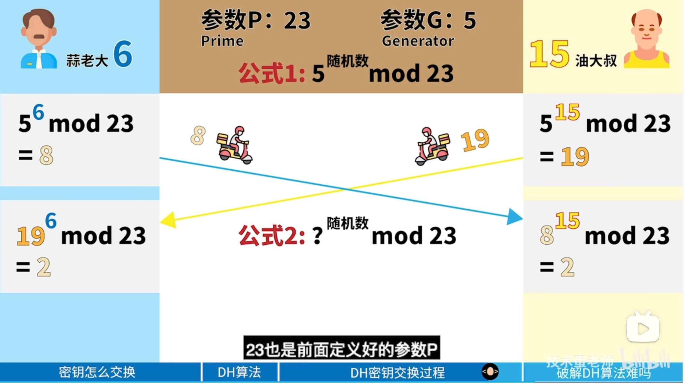

# RSA 非对称加密 秘钥交换算法

下面是根据提供的网页内容，按照Markdown格式整理的文章：

---

# SSL/TLS密钥协商算法的演变——RSA算法、DH算法、DHE算法、ECDHE算法

SSL(Secure Sockets Layer)最初由Netscape定义, 分别有SSLv2和SSLv3两个版本(SSLv1未曾对外发布); 在SSLv3之后SSL重命名为TLS。

| 协议 | 时间 | 建议 | 说明 |
| --- | --- | --- | --- |
| SSLv1 | / | / | 实际从未公开发布 |
| SSLv2 | 1995 | 弃用 | IETF已于2011年弃用 |
| SSLv3 | 1996 | 弃用 | IETF已于2015年弃用 |
| TLSv1.0 | 1999 | 兼容 | - |
| TLSv1.1 | 2006 | 兼容 | - |
| TLSv1.2 | 2008 | 主推 | 目前最新可用版本 |
| TLSv1.3 | / | / | 2016开始草案制定 |

### 证书校验

**1、CA机构颁发给服务器的数字证书中包含哪些内容？**

至少包含了向CA机构申请证书时的“个人信息”， “证书有效期”、“证书的公钥”、“CA机构给到证书的数字签名”、“CA机构信息”等。

**2、浏览器如何验证证书？**

首先，浏览器利用证书中指定的hash算法如sha256对”明文信息”计算出信息摘要。

然后，利用CA证书的公钥来解密 数字证书 中的”数字签名”。

最后，判定两个摘要信息是否相等就行。

如何证明CA证书本身不是伪造的呢？

简单粗暴的方案是：操作系统内置所有CA机构的证书，且假设这个操作系统没有被恶意入侵。

折中方案是：把CA机构分成两类，根CA和中间CA, 我们通常向中间CA申请证书，根CA主要给中间CA做认证用。

### 一、RSA密钥交换算法

传统的 TLS 握手基本都是使用 RSA 算法来实现密钥交换的。

RSA算法流程文字描述如下：

1. 任意客户端对服务器发起请求，服务器首先发回复自己的公钥到客户端（公钥明文传输）。
2. 客户端使用随机数算法，生成一个密钥S，使用收到的公钥进行加密，生成C，把C发送到服务器。
3. 服务器收到C，使用公钥对应的私钥进行解密，得到S。
4. 上述交换步骤后，客户端和服务器都得到了S，S为密钥（预主密钥）。

RSA密钥协商算法有几个优点：

- 每次连接阶段的会话密钥是不同的，无须存储到设备中，连接关闭后会话密钥就会消失。
- 每次连接中的会话密钥是不同的，避免了烦琐的会话密钥分配问题。
- 虽然RSA运算很慢，但由于会话密钥长度相对很小，计算的数据量并不大，所以性能消耗相对可控。

RSA密钥协商算法也有缺点：

- 获取会话密钥过程其实并不能称为协商，完全是由客户端决定的，只能称为密钥传输。
- 如果客户端生成会话密钥没有使用标准的算法，可能会带来安全隐患。
- 另外一个最大的问题就是不能提供前向安全性。

### 二、DH密钥协商算法

离散对数

Diffie-Hellman算法，简称DH算法，是Whitfield Diffie和Martin Hellman在1976年公布的一个公开密钥算法。

DH算法确切地说，实现的是密钥交换或者密钥协商，DH算法在进行密钥协商的时候，通信双方的任何一方无法独自计算出一个会话密钥。

### 三、DHE密钥交换算法

DHE（E全程为ephemeral（临时性的））：既然固定一方的私钥有被破解的风险，那么干脆就让双方的私钥在每次密钥交换通信时，都是随机生成的、临时的。

### 四、ECDHE密钥交换算法

ECDHE是DH算法的一种变体。

它使用椭圆曲线密码学来实现密钥交换过程。与传统的DH算法相比，ECDHE在提供相同的安全性的同时，具有更高的效率和较短的密钥长度。

ECC（椭圆曲线密码学）：椭圆曲线密码学（Elliptic curve cryptography），简称ECC，是一种建立公开密钥加密的算法，也就是非对称加密。

### 以下是抓包示例

客户端发出请求(Client Hello), 提供给服务端以下信息：

- TSL 1.2
- 以及16种密码套件
- 随机数
- Session ID

服务端回应(Server Hello), 提供给客户端以下信息

可以看到服务端提供了类似信息，只支持TLS_CHACHA20_POLY1305_SHA256

---

请注意，Markdown格式主要通过使用特定的标记符号来实现格式化，如`#`用于标题，`|`和`---`用于表格，`-`用于无序列表等。在实际使用中，可能需要根据具体编辑器或显示平台的要求进行适当调整。

# DH 非对称加密 秘钥交换算法

1、

https://blog.csdn.net/u014644574/article/details/131657502

